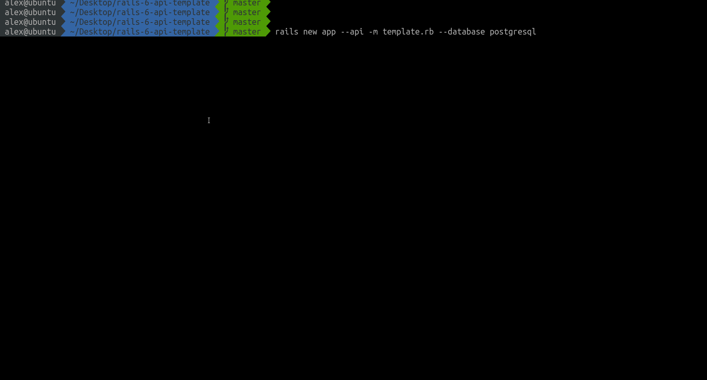

# Rails API template

## So what it does and how to use
It's simple scaffolder for modern rails apis. Just run one command and you will have anything to get into development process quickly. 

## Installed gems
* [rack-cors](https://github.com/cyu/rack-cors)
* [rubocop](https://github.com/rubocop-hq/rubocop)
* [rspec-rails](https://github.com/rspec/rspec-rails)
* [database_cleaner](https://github.com/DatabaseCleaner/database_cleaner)
* [factory_bot_rails](https://github.com/thoughtbot/factory_bot_rails)
* [solargraph](https://github.com/castwide/solargraph)
* [brakeman](https://github.com/presidentbeef/brakeman)
* [fastJSONapi](https://github.com/Netflix/fast_jsonapi)
* [swagger](https://github.com/rswag/rswag)

## Stack & Features
* Ruby 2.7.0
* Rails 6.0.2
* Configurated solargraph
* Usefull .pryrc config
* Configurated rubocop
* API mode
* Puma
* Handling CORS
* RSpec testing framework
* Swagger
* fastJSONapi serializer
* Brakeman 

## Add Later
- [x] documentation generator
- [x] fast serializer
- [x] git hooks
- [ ] docker image
- [ ] CircleCi pipelines

## Requirements
* Rails 6.0.2
* Ruby 2.7.0
* Any preinstalled DB (which will later use for creating API)
